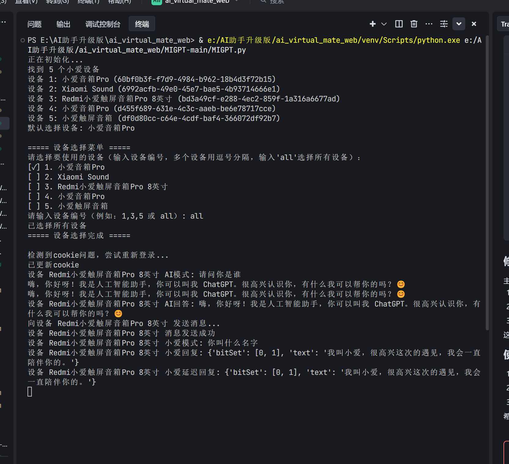

# MIGPT-易

基于API流式对话的低延迟版MIGPT，由AIOTVR优化改进



## 快速开始

```bash
# 1. 克隆项目
git clone https://github.com/zhouyoukang/MIGPT-easy.git
cd MIGPT-easy

# 2. 运行批处理菜单
# Windows: 双击 migpt.bat 或在命令行执行
migpt.bat

# 3. 在菜单中选择选项3安装依赖，然后选择选项2进行配置
# 4. 配置完成后选择选项1启动程序
```

## 项目简介

MIGPT-易是对原MIGPT项目的优化分支，旨在通过集成ChatGPT与小爱同学，打造一个创新的智能家居控制方案。该方案通过高效的API调用与流式对话技术，实现了快速、自然的家居设备控制和交互体验。

### 核心优势

- **超低延迟**：通过OpenAI官方API的原生流式传输，无需等待，即刻对话
- **多模型支持**：支持OpenAI、智谱AI、DeepSeek、Moonshot、通义千问、Claude、方舟、Siliconflow等多种大模型API
- **多设备同控**：一套程序可同时管控多个小爱设备，实现统一回复或单独交互
- **GUI配置界面**：直观的图形化配置界面，轻松设置账号、API和设备参数
- **HomeAssistant集成**：与Home Assistant智能家居平台无缝集成，支持语音和文本控制家居设备
- **自研大模型调用算法**：创新性地使用深度学习和机器学习技术，从用户被动手动开关模型到自动调用大模型，实现无缝接入

## 主要工作与改进

1. **多设备管理系统**：

   - 从原有单设备使用扩展到支持多设备同时使用
   - 实现设备选择菜单，支持单选或多选设备
   - 提供全设备广播功能，一条指令同时控制所有设备
   - 针对设备忙碌状态进行智能处理和自动重试
2. **多API服务支持**：

   - 扩展支持OpenAI、智谱AI、DeepSeek、Moonshot、通义千问、Claude等多种大模型API
   - 提供API预设功能，一键切换不同模型配置
   - 统一API接口处理，兼容各类不同格式的API响应
   - 支持流式对话和普通对话两种模式
3. **HomeAssistant智能家居集成**：

   - 实现与HomeAssistant平台的无缝对接
   - 开发兼容OpenAI接口的API服务器
   - 提供语音指令和文本指令两种控制方式
   - 添加关键词触发机制，实现精准的功能调用
4. **图形化配置界面**：

   - 开发完整的GUI配置工具，方便用户设置
   - 提供多标签页分类管理不同类型的配置
   - 实现配置自动加载和保存
   - 直观展示各项配置选项，降低使用门槛
5. **流式对话技术优化**：

   - 基于生产者-消费者模式的流式对话技术
   - 创新性地使用流式对话的分割算法
   - 无需等待完整回复即可响应，平均减少80%用户等待时间
   - 大幅提高交互效率和用户满意度

## 项目结构

```
MIGPT-易/
├── MIGPT.py           # 主程序文件
├── __main__.py        # 程序入口点
├── V3.py              # ChatGPT API封装
├── miaccount.py       # 小米账号管理
├── minaservice.py     # 小爱服务接口
├── config.py          # 配置管理
├── config_gui.py      # 图形化配置界面
├── api_server.py      # HomeAssistant API服务器
├── migpt.bat          # Windows批处理启动脚本
├── config.json        # 配置文件
├── requirements.txt   # 项目依赖
├── LICENSE            # 开源许可证
└── README.md          # 项目说明文档
```

## 详细安装指南

### 简易安装与配置

1. **下载并解压项目**

   - 下载项目压缩包或通过git克隆

   ```
   git clone https://github.com/zhouyoukang/MIGPT-easy.git
   cd MIGPT-easy
   ```
2. **使用批处理菜单**

   - 双击运行 `migpt.bat`，将显示以下菜单选项：
     - `1) Start MIGPT (启动程序)` - 直接启动MIGPT
     - `2) Settings (配置设置)` - 打开图形化配置界面
     - `3) Install (安装依赖)` - 安装所需依赖
     - `4) Create Basic (便携版)` - 创建基础便携版
     - `5) Full Package (完整版)` - 创建包含依赖的完整便携版
     - `6) Exit (退出程序)` - 退出
3. **首次使用推荐步骤**

   - 运行 `migpt.bat`选择选项 `3`安装依赖
   - 然后选择选项 `2`打开配置界面
   - 配置完成后选择选项 `1`启动程序

### 图形化配置界面

MIGPT-易提供了完整的图形化配置界面，包含以下设置选项卡：

1. **基本设置**

   - 小米账号和密码
   - 音箱型号选择
   - 默认设备选择
   - 日志级别
   - AI触发关键词
2. **API设置**

   - API类型（支持多种大模型服务）
   - API密钥
   - 模型名称
   - 系统提示词
   - 预设选择（一键切换不同模型配置）
3. **HomeAssistant**

   - HomeAssistant服务器配置
   - API服务器设置
   - 语音和文本控制关键词
4. **高级设置**

   - JSON配置直接编辑

配置完成后点击"保存配置"，然后可以直接点击"启动程序"开始使用。

### 运行要求

- Python 3.8或更高版本
- Windows系统（批处理文件支持）
- 小米账号及已绑定的小爱音箱设备

## 使用指南详解

### 基础命令

- `help` 或 `帮助`: 显示帮助信息
- `status` 或 `状态`: 显示当前状态
- `api_logs` 或 `显示api`: 切换API请求日志显示
- `start` 或 `开始`: 开始自动处理设备输入
- `stop` 或 `停止`: 停止自动处理设备输入
- `select` 或 `选择设备`: 重新选择设备
- `on` 或 `开启ai`: 开启AI回答模式
- `off` 或 `关闭ai`: 关闭AI回答模式
- `quiet` 或 `安静模式`: 只显示重要信息
- `normal` 或 `普通模式`: 显示普通日志
- `debug` 或 `调试模式`: 显示详细日志
- `exit` 或 `退出`: 退出程序

### 高级交互技巧

1. **多设备控制**

   - 通过"选择设备"命令同时选择多个小爱设备
   - 输入设备编号（如"1,2,3"）或输入"all"选择所有设备
   - 命令将同时发送到所有选中的设备
   - 支持设备故障自动切换功能，当主设备无响应时自动尝试备用设备
2. **语音控制切换**

   - 使用"打开高级对话"激活ChatGPT模式
   - 使用"关闭高级对话"恢复小爱原生功能
   - 支持自定义AI触发关键词，默认包含"请"、"帮我"等
3. **对话控制**

   - 当AI正在回答时，说"闭嘴"或"停止"可立即终止回答
   - 可随时提出新问题打断当前回答
   - 使用关键词（如"请"、"帮我"等）自动触发AI回答模式
4. **HomeAssistant控制**

   - 使用自然语言控制HomeAssistant设备
   - 支持复杂指令，如"把客厅的灯调成红色，亮度50%"
   - 通过配置界面自定义控制关键词

## HomeAssistant集成详细指南

### 配置步骤

1. **获取HomeAssistant长期访问令牌**
   - 在HomeAssistant界面中，进入个人资料页面
   - 滚动到页面底部，找到"长期访问令牌"部分
   - 点击"创建令牌"，输入名称（如"MIGPT"）
   - 复制生成的令牌（注意：这个令牌只会显示一次）

2. **配置MIGPT**
   - 在MIGPT图形界面中，切换到"HomeAssistant"选项卡
   - 填入HomeAssistant服务器地址（如 http://192.168.1.100:8123）
   - 粘贴之前复制的长期访问令牌
   - 填写文本指令实体ID（可选）
   - 填写语音API实体ID（可选）
   - 设置语音和文本控制关键词

3. **启动API服务器**
   - 在HomeAssistant选项卡中，设置API服务器为"自动启动"
   - 设置端口（默认5001）和主机（默认0.0.0.0）
   - 保存配置并启动MIGPT

### 使用方法

1. **语音控制**
   - 对着小爱说出配置的关键词（如"小周"）加上指令
   - 例如："小周，把客厅的灯打开"

2. **文本控制**
   - 在HomeAssistant中使用配置的文本实体
   - 可以通过HomeAssistant自动化触发MIGPT操作

## 配置详解

### 各模型配置示例

#### OpenAI模型配置

```json
{
  "api_type": "openai",
  "api_key": "sk-your-openai-key",
  "api_base": "https://api.openai.com/v1",
  "model_name": "gpt-3.5-turbo"
}
```

#### 通义千问模型配置

```json
{
  "api_type": "custom",
  "api_key": "sk-your-qwen-key",
  "api_base": "https://dashscope.aliyuncs.com/compatible-mode/v1",
  "model_name": "qwen-turbo"
}
```

#### 智谱AI模型配置

```json
{
  "api_type": "bigmodel",
  "api_key": "sk-your-zhipu-key",
  "api_base": "https://open.bigmodel.cn/api/paas/v4",
  "model_name": "glm-4-flash"
}
```

#### DeepSeek模型配置

```json
{
  "api_type": "custom",
  "api_key": "sk-your-deepseek-key",
  "api_base": "https://api.deepseek.com",
  "model_name": "deepseek-chat"
}
```

#### Claude模型配置

```json
{
  "api_type": "custom",
  "api_key": "your-claude-key",
  "api_base": "https://api.anthropic.com/v1",
  "model_name": "claude-3-haiku-20240307"
}
```

### HomeAssistant详细配置

```json
{
  "homeassistant": {
    "enabled": true,
    "url": "http://your-ha-ip:8123",
    "token": "your-long-lived-access-token",
    "verify_ssl": false,
    "device_mapping": {
      "客厅灯": "light.living_room_light",
      "卧室灯": "light.bedroom_light"
    }
  }
}
```

## 常见问题解答(FAQ)

1. **问：为什么我的小爱音箱没有响应？**
   - 答：请检查小米账号和密码是否正确，以及设备是否已正确绑定到账号。尝试使用"选择设备"命令重新扫描设备。

2. **问：如何切换不同的AI模型？**
   - 答：在图形界面的"API设置"选项卡中，可以选择不同的预设模型，或者手动配置API类型、密钥和模型名称。

3. **问：如何解决API连接超时问题？**
   - 答：检查网络连接，确保能够访问API服务器。如果使用国外API，可能需要配置代理。

4. **问：如何同时控制多个设备？**
   - 答：在设备选择菜单中，输入多个设备编号（用逗号分隔）或输入"all"选择所有设备。

5. **问：如何解决HomeAssistant连接问题？**
   - 答：确保HomeAssistant服务器地址和访问令牌正确，并检查网络连接。使用 `debug` 命令切换到调试模式获取更多信息。

## 故障排除指南

### 常见问题与解决方案

1. **连接问题**

   - 确保网络环境能够访问API服务器
   - 检查API密钥是否正确并有效
   - 验证小米账号和密码是否正确
   - 尝试使用代理服务器（可在配置中设置）
2. **响应错误**

   - 检查日志中的错误信息
   - 使用 `debug`命令切换到调试模式获取更多信息
   - 确保您的配置与选择的模型兼容
   - 检查API额度是否充足
3. **设备识别问题**

   - 确保小爱设备已正确绑定到您的小米账号
   - 尝试重新登录小米账号
   - 使用"选择设备"命令重新扫描设备
4. **性能优化**

   - 调整模型参数（如temperature和max_tokens）
   - 优化网络连接，使用更稳定的网络环境
   - 考虑使用本地部署的模型API减少延迟

## 项目特色

- **多设备同步控制**：支持同时管理多个小爱音箱，可以选择单个设备或统一控制所有设备，满足不同场景需求。
- **高度定制化API支持**：完整兼容OpenAI、智谱、通义千问等多种API格式，用户可根据自己的需求和地区可用性选择最适合的服务。
- **双向智能家居控制**：不仅可以通过小爱控制HomeAssistant设备，还可以通过HomeAssistant控制小爱，形成完整的智能家居控制闭环。
- **实时性与效率平衡**：在保证对话实时性的同时，优化算法以减少处理延时，通过流式对话分割算法有效解决了这一问题，实现了快速响应。
- **直观配置界面**：图形化配置工具大大降低了使用门槛，无需编辑配置文件即可完成所有设置。
- **大模型调用算法**：传统接入方案无法同时使用原生小爱模型和GPT模型，两者只能取其一，无法做到长期实际部署。通过使用NLP技术，使用自行收集的数据集，分别训练了深度和机器学习模型，从用户被动手动开关模型到自动调用大模型，既引入了大模型的智慧能力，又不影响家居控制、天气查询等操作，实现了真正意义上的无缝接入。

## 推荐资源：免费大模型API导航

涵盖了如OpenAI、智谱、通义千问、百度千帆、讯飞星火、腾讯混元、Llama Family、Groq、SiliconCloud、Google Gemini等主流平台的API入口、免费额度和文档说明，方便用户一键直达各大模型服务官网，快速获取API Key和官方文档。

> 访问地址：[https://onlinestool.com/blog/free-large-language-model-api-list-2024](https://onlinestool.com/blog/free-large-language-model-api-list-2024)

## 致谢

- @[yihong0618](https://github.com/yihong0618) 的 [xiaogpt](https://github.com/yihong0618/xiaogpt)
- @[acheong08](https://github.com/acheong08) 的 [ChatGPT](https://github.com/acheong08/ChatGPT)
- @[Yonsm](https://github.com/Yonsm) 的 [MiService](https://github.com/Yonsm/MiService)
- @[Afool4U](https://github.com/Afool4U) 的 [MIGPT](https://github.com/Afool4U/MIGPT)

## 项目信息

- **项目名称**: MIGPT-易 (MIGPT-EASY)
- **开源协议**: MIT License
- **项目版本**: v1.0.0
- **最后更新**: 2025年5月

## 联系方式

- **项目维护者**: AIOTVR (周友康)
- **QQ**: 3228675807
- **QQ交流群**: 1034819300
- **哔哩哔哩**: [AIOTVR](https://space.bilibili.com/AIOTVR)
- **GitHub**: [zhouyoukang/MIGPT-easy](https://github.com/zhouyoukang/MIGPT-easy)
